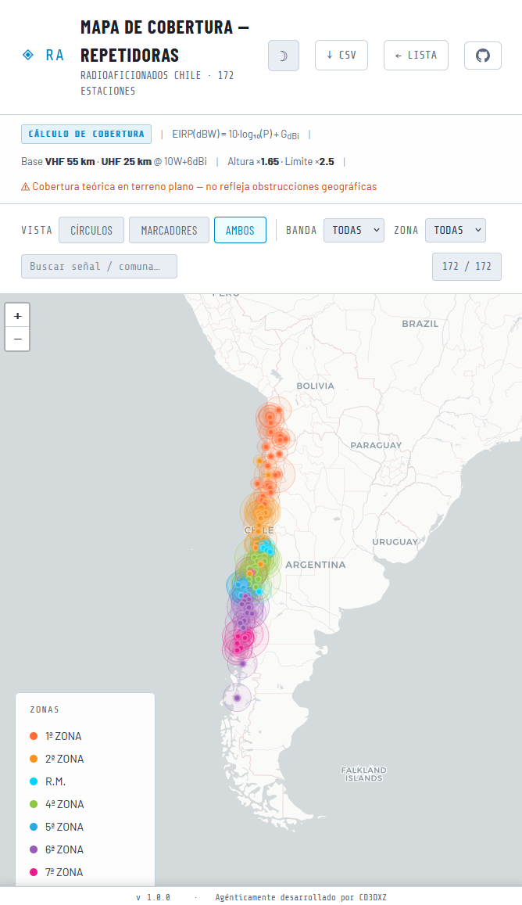
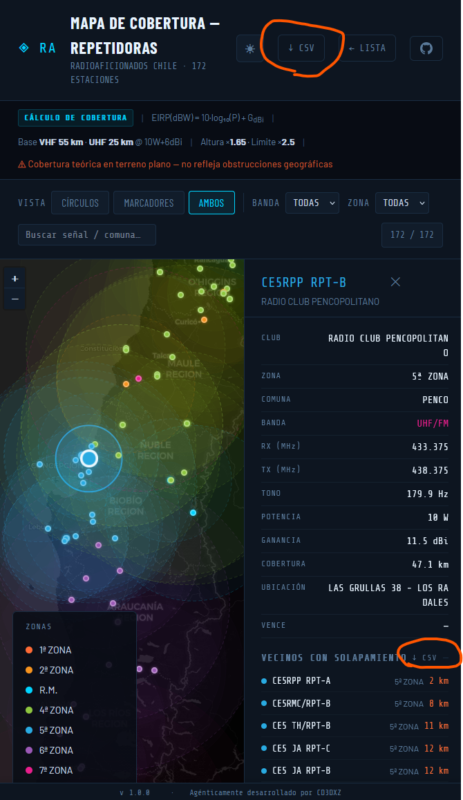

# Radiomap

**Mapa y lista de repetidoras de radioaficionados en Chile** — dónde están, qué cubren y cómo contactar. Incluye repetidoras SUBTEL y nodos Echolink (Red Chile, Red Echolink Chile, RCDR). Datos oficiales SUBTEL/DGMN.

[**→ Abrir la aplicación**](https://www.radiomap.cl/)

---

## Para qué sirve

- **Ver en el mapa** todas las repetidoras y nodos Echolink, su cobertura teórica y ubicación.
- **Buscar por señal, comuna, frecuencias (RX/TX/tono)** o filtrar por banda, región y tipo (Radioclubes / Echolink).
- **Revisar datos** de cada nodo (club, potencia, vencimiento, conferencia Echolink) y descargar listas en CSV.
- **Botón 📍** para mostrar solo nodos cerca de tu ubicación (100 km).

Ideal para planificar rutas, elegir repetidora o tener a mano el listado actualizado.

---

## Cómo se usa

### Mapa de cobertura




- Explora el mapa (modo oscuro/claro con ☽).
- **Vista** (iconos): marcador, círculo de cobertura o ambos.
- **Filtros**: banda (VHF/UHF), región, tipo (Todos los Tipos / Solo Echolink / Solo Radioclubes) y conferencia Echolink.
- Búsqueda por texto: señal, comuna, frecuencia…
- **Clic en un punto**: datos completos y nodos cercanos en el panel lateral. Los Radioclubes muestran un punto de color; los Echolink un cuadrado con «e». Desde ahí puedes descargar CSV de nodos cercanos o compartir la lista.

### Lista de repetidores


- Tabla agrupada por región con señal, banda, RX/TX, tono, potencia, club, comuna y vencimiento.
- Mismos filtros y búsqueda (incluye frecuencias).
- **Descarga CSV** siempre visible en el header (también en móvil).

En ambas vistas puedes cambiar el tema (claro/oscuro) y exportar a CSV. Interfaz optimizada para móvil (controles compactos, header adaptable).

---

## Datos

La información proviene del **listado oficial de repetidoras** de la [Subsecretaría de Telecomunicaciones (SUBTEL)](https://www.subtel.gob.cl/), más nodos **Echolink** (Red Chile, Red Echolink Chile, RCDR). La fuente de datos es `data/curated_stations.csv`, que puede curarse para corregir errores del origen.

Las regiones siguen la división administrativa de Chile (SUBTEL/DGMN).

---

## Ejecutarlo en local

Si quieres correr la app en tu máquina:

```bash
python -m http.server 8080
```

Luego abre `http://localhost:8080/` (mapa) o `http://localhost:8080/lista.html` (lista).  
Usar un servidor local (y no `file://`) ayuda a que el tema y preferencias se guarden bien.

---

*Desarrollado por [CD3DXZ](https://cd3dxz.radio)*
